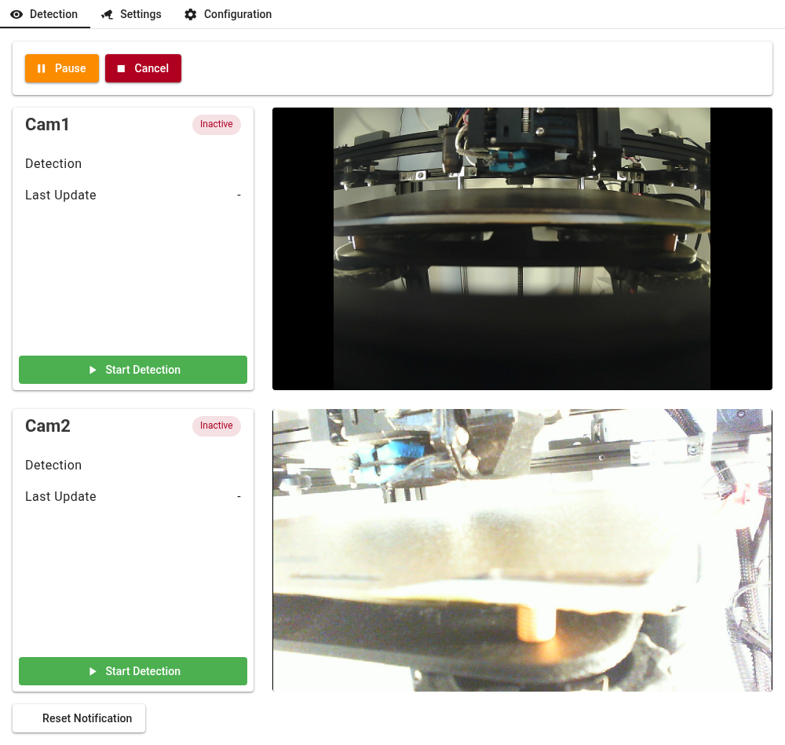
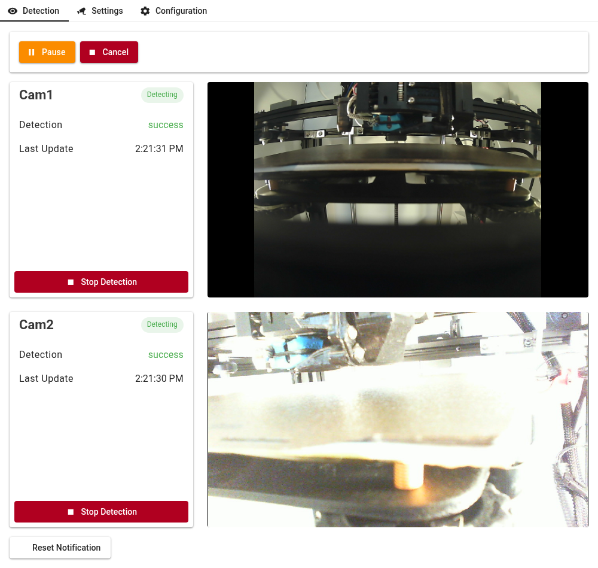
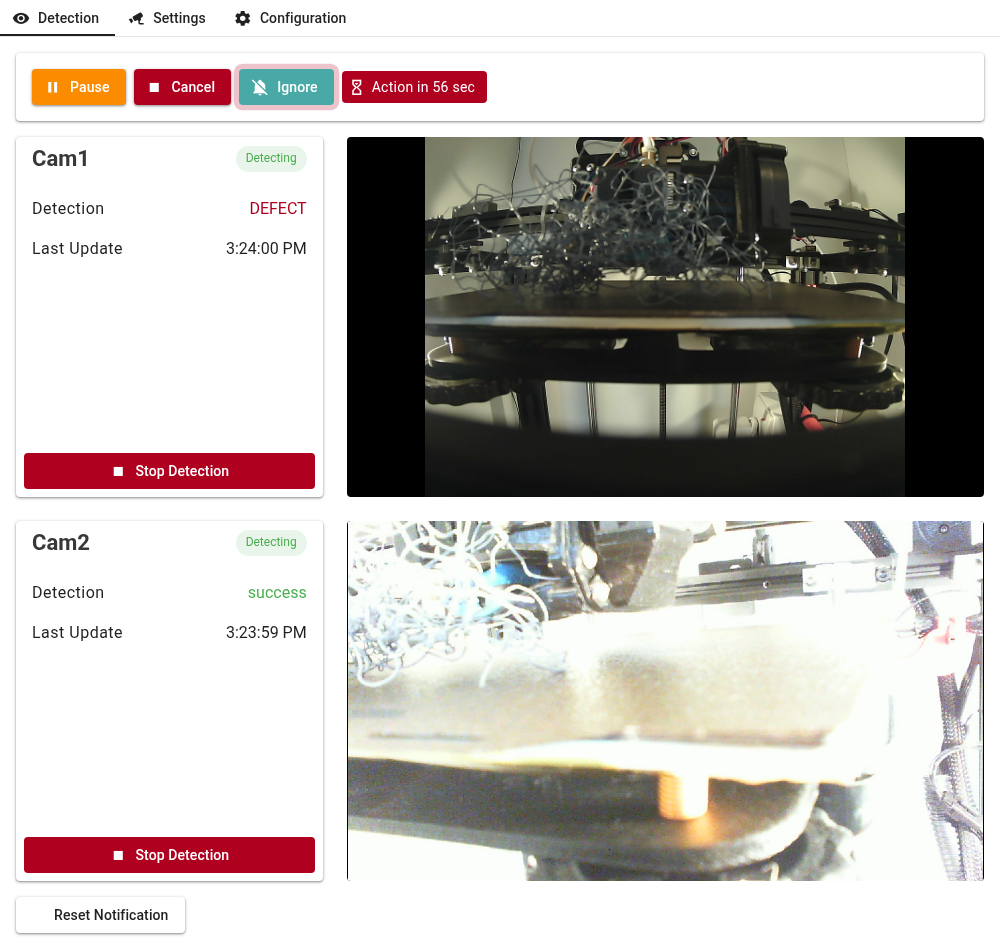
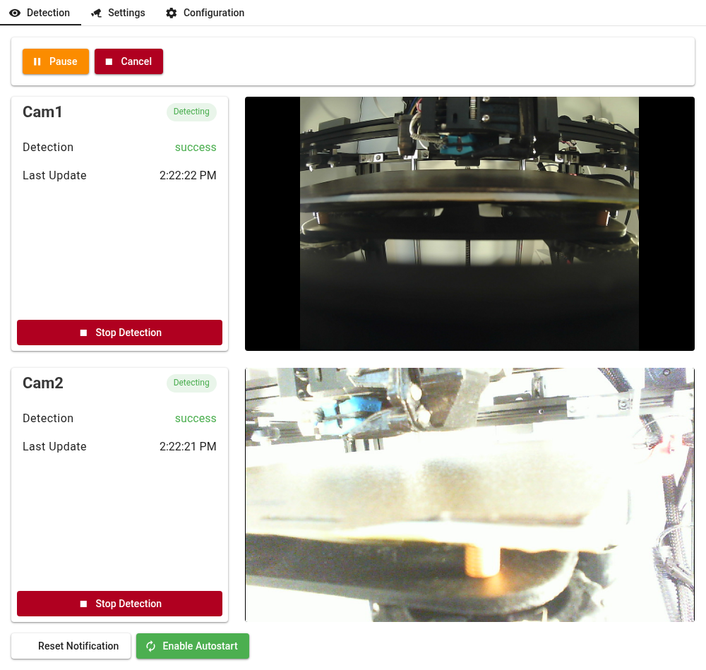

# duetPrintGuard - Basic Operation

The main page is accessible via `http://localhost:<PORT>` or `http://<IP>:<PORT>`  This is the page displayed in DWC

IP and PORT are those in use by the plugin. They are shown on the Configuration page and in the log file at startup.

The tabs at the top of each page switch between the three pages:
- Detection - the main page, described here
- Settings - cameras and the defect countdown (see [Installation-Configuration](Installation-Configuration.md#camera-setup))
- Configuration - printer commands, notifications and the web interface (see [Installation-Configuration](Installation-Configuration.md#configuration-page))

Broadly, there are three main states
- Not Detecting
- Detecting - No Defect
- Detecting - Defect

### Not Detecting

This image shows the Detection page comprising three sections.
- top control section
- middle camera section
- bottom control section

 

The top control section provides printer control (`Pause` / `Resume` and `Cancel`) and displays countdown information. Each button asks for confirmation before it is sent to the printer.

In the middle section: each configured camera is shown separately with the following details:
 - The Camera nickname
 - Current detection status [Inactive]
 - Current detection result [-]
 - The time of the last update [-]
 - A snapshot of the camera's view, refreshed every few seconds
 - A button to toggle Detecting on and off [Start Detection]

 Note that clicking on a camera snapshot will open a live view. The live view has a button to open it in a separate tab.

 ### Detecting - No Defect

 Once a camera is detecting the display is updated regularly with:

 - Current detection status [Detecting]
 - Current detection result [success, failure]
 - The time of the last update [time]
 - A button to toggle Detecting on and off [Stop Detection]

 
 
### Detecting - Defect

If a failure occurs several things happen:

On the top control section:
 - An `Ignore` button is added
 - A countdown is shown, labelled with the configured `Countdown Action` (`Pause in .. sec`, `Cancel in .. sec`, or `Action in .. sec` when the action is Ignore)
 - The button for the configured `Countdown Action` flashes

The camera information is updated
 - Current detection status [Detecting]
 - Current detection result [DEFECT]
 - The time of the last update [time]
 - A button to toggle Detecting on and off [Stop Detection]

Pressing `Pause`, `Cancel` or `Ignore` during the countdown stops the countdown and takes that action immediately. `Ignore` dismisses the defect so that a new one can be raised.

If the user does nothing within the configured `Countdown Time` - the `Countdown Action` will be sent to the printer as follows:

- Ignore - does nothing
- Pause - pauses the printer, stops detection, and changes the `Pause` button to `Resume`. Resuming the print restarts detection.
- Cancel - cancels the print job and stops detection
 

### Bottom Control section
 The bottom control section comprises one or two buttons.
 - Reset Notification
 - Enable / Disable Autostart

 Reset Notification resets all the notification counters to zero. I.e Notifications will be sent up to `Maximum Times` (per the Macro, ntfy and Pushover settings on the Configuration page)

 Enable / Disable Autostart will display if one or more cameras is configured for auto start.

 If autostart is enabled, detection will commence once a print job has started and will stop when the print job is complete.  This allows duetPrintGuard to run in the background but note: Once a print job has completed, autostart needs to be reenabled.  This was an implementation decision to avoid constant use of cpu between print jobs.

 
