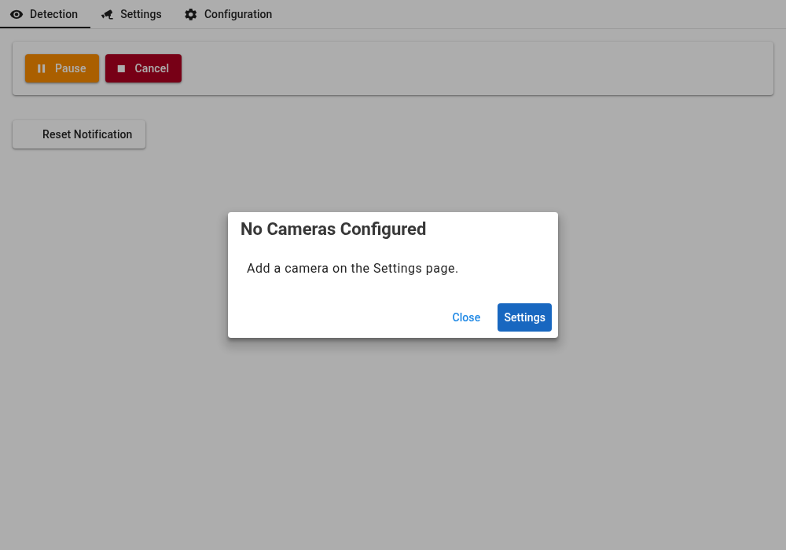
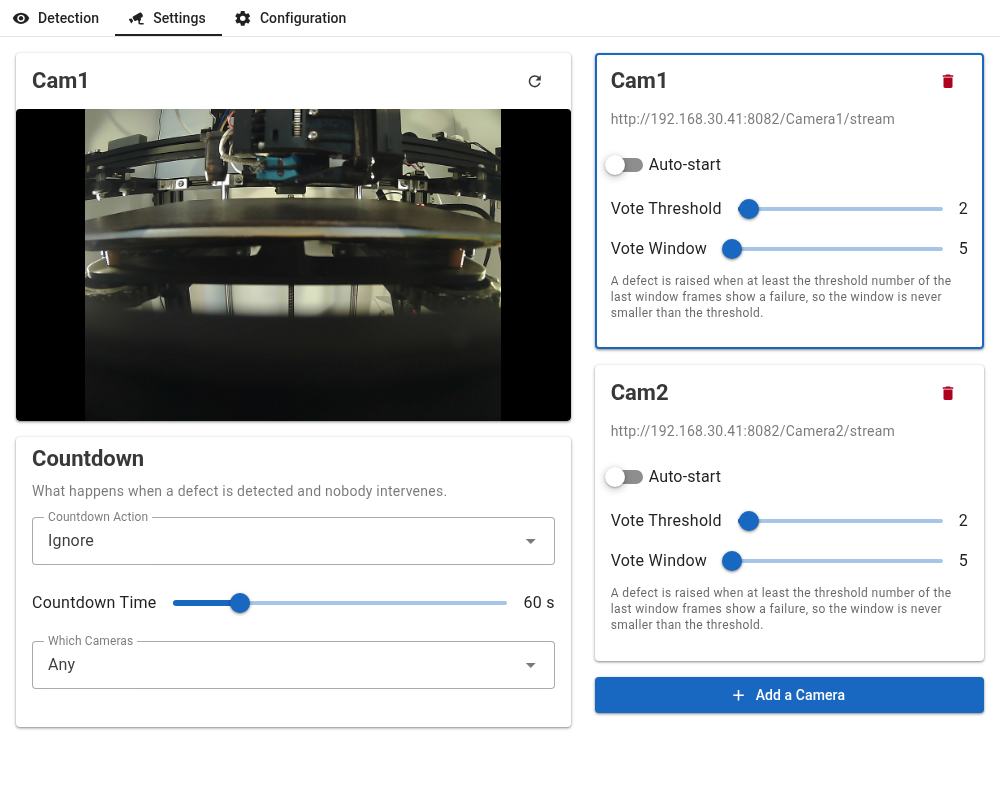
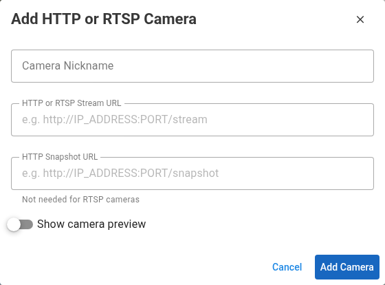
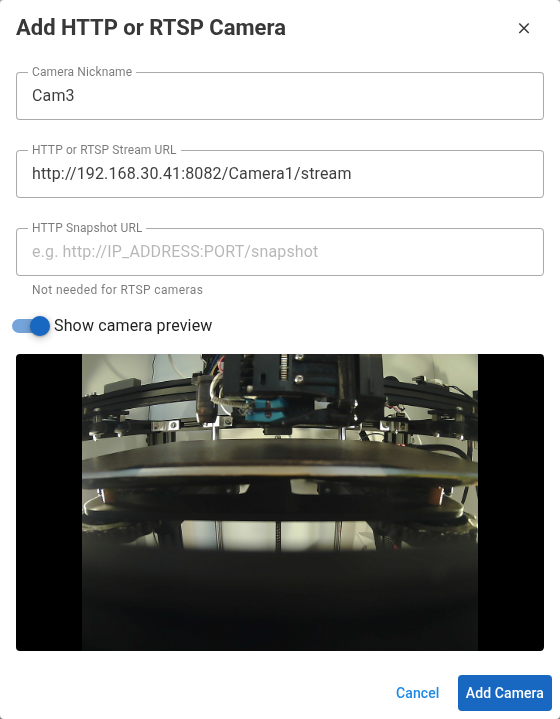
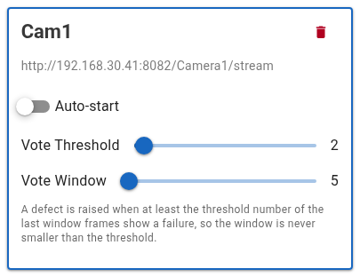
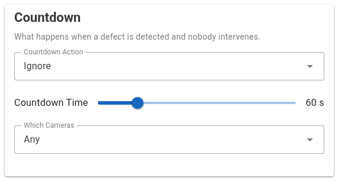
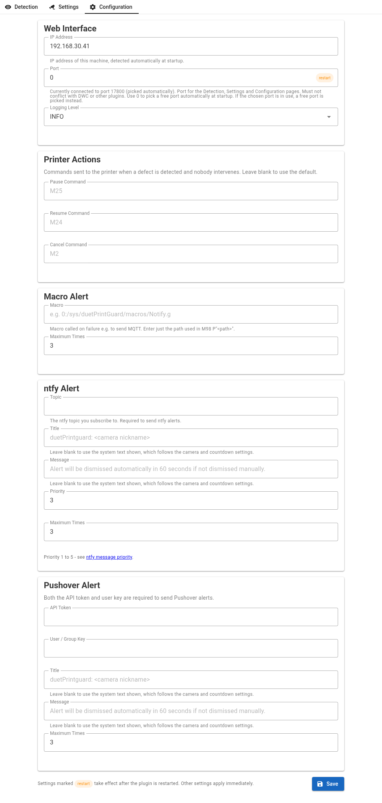

# duetPrintGuard - Getting Started

## Installation
duetPrintGuard is packaged as a DWC plugin and installed in the normal manner from the zip file found in the plugin directory here:

[3.7.x](..)

## Configuration

No configuration file needs to be created. On first start the plugin creates `duetPrintGuard.json` with default settings (and no cameras) in the `system/duetPrintGuard` directory (`/opt/dsf/sd/sys/duetPrintGuard`), alongside the log file `duetPrintGuard.log`.

All settings are held in this one file: the general configuration, the camera settings and the defect countdown settings.

The file is stored compressed and base64 encoded, with a checksum. Edit settings through the plugin's Configuration and Settings pages - do not edit the file by hand. If the file is edited, damaged or otherwise fails the checksum, it is deleted at startup and a new one is created from the defaults. **All settings, including any configured cameras, are lost when this happens** and will need to be set up again.

Settings are changed from the Settings page (cameras and the defect countdown) and the Configuration page (everything else) - see below.

The IP address is detected automatically and the address in use is saved to `duetPrintGuard.json` and passed to DWC, so the plugin page always connects to the right address.

If `Port` is 0 or already in use, a free port is chosen at startup. The configured `Port` value is not changed, so a value of 0 picks a free port on every startup, and a busy port is tried again on the next startup. The Configuration page shows the port currently in use, and whether a different configured port will be used after a restart.

## Logging

When the plugin is run, a log file `duetPrintGuard.log`  is created in the `system/duetPrintGuard` directory.

## Setup
When the plugin is first accessed - the Detection page will display with a message stating that there are no cameras configured.  Press the "Settings" button (or the Settings tab) to configure one or more cameras.

## Camera Setup

The Settings page is accessible from the Settings tab or via `http://localhost:<PORT>/settings` or `http://<IP>:<PORT>/settings`

Where IP and PORT are the address shown on the Configuration page or in the log file at startup.

This page allows you to configure the action to be taken on failure, the cameras and their detection settings.

The left side shows a preview of the selected camera (click a camera card to select it, and the refresh button to update the preview) and the Countdown settings. The right side shows a card for each camera and the `Add a Camera` button.

Changes on this page are saved as soon as they are made.

  
### Adding Cameras

Multiple network cameras can be configured. Both HTTP (MJPEG) and RTSP streams are supported.

Press `Add a Camera` to open the Add Camera dialog. If no cameras are configured, it opens automatically.

- `Camera Nickname` - the name shown on the Detection page
- `HTTP or RTSP Stream URL` - the camera stream
- `HTTP Snapshot URL` - a URL that returns a single JPEG image. Required for HTTP cameras (it is used for detection and the Detection page snapshots). Not needed for RTSP cameras
- `Show camera preview` - shows the camera stream, to check the URL is correct before adding the camera

Each camera must have a unique nickname and a unique stream URL.

When `Add Camera` is pressed, the plugin checks that video can be read from the stream URL and, if given, that the snapshot URL returns a JPEG image. This can take a few seconds. If either check fails, the camera is not added and an alert in the dialog says which URL did not work. Correct the URL and press `Add Camera` again.

### Camera Settings

Each camera card shows the camera nickname and stream URL, and has these settings:
- `Auto-start` - see Autostart in [Basic Operation](Basic-Operation.md#bottom-control-section)
- `Vote Threshold` and `Vote Window` - see Defect Settings below

The delete button (top right of the card) removes the camera.

## Defect Settings

A DEFECT is raised when the camera detects a series of failure frames that satisfy this rule:

If: There are at least "x" failure frames in the last "y" frames where:
x == `Vote Threshold` (Majority Vote Threshold)
y == `Vote Window` (Majority Vote Window)

The window can never be smaller than the threshold (otherwise a defect could never be raised). Moving one slider past the other drags the other slider along with it.

Optimal values for these settings depend on many factors such as the type and position of the camera, lighting conditions, nature and shape of the failure etc.

## Defect Behavior

When a defect is detected several things happen
- Notifications are sent, depending on the settings on the Configuration page
- A countdown timer, set by `Countdown Time`, is started
- At the end of the countdown `Countdown Action` is sent to the printer

`Countdown Action` allows the selection of one of three actions that will occur when a Defect is detected.  These are Ignore, Pause and Cancel.

`Countdown Time` If there is no manual override within this time then the selected action will be sent to the printer.

`Which Cameras` specifies if a DEFECT requires `Any` camera or `All` cameras to detect failures at the same time.

## Configuration Page

The Configuration page is accessible from the Configuration tab or via `http://<IP>:<PORT>/config`. Press `Save` at the bottom of the page to save changes. Settings marked `restart` take effect after the plugin is restarted. Other settings apply immediately.

`Web Interface`
- `IP Address` - detected automatically at startup (read only)
- `Port` - the port for the Detection, Settings and Configuration pages. Must not conflict with DWC or other plugins. Use 0 to pick a free port automatically (see Configuration above)
- `Logging Level` - WARNING, INFO or DEBUG

`Printer Actions` - the commands sent to the printer for Pause (default `M25`), Resume (default `M24`) and Cancel (default `M2`). Leave blank to use the default.

`Macro Alert` - a macro called when a defect is detected, e.g. to send MQTT. Enter just the path used in `M98 P"<path>"`. `Maximum Times` limits how many times it is called.

`ntfy Alert` - sends an alert to an [ntfy](https://ntfy.sh) `Topic`. `Priority` is 1 to 5.

`Pushover Alert` - sends an alert via [Pushover](https://pushover.net). Both the `API Token` and the `User / Group Key` are required.

The ntfy and Pushover `Title` and `Message` fields can be left blank. When blank, a system generated title and message are sent. These are shown as the placeholder text in each field and follow the current camera and countdown settings (e.g. the camera nickname, the `Countdown Action` and the `Countdown Time`).

`Maximum Times` limits how many alerts are sent. Use `Reset Notification` on the Detection page to reset the counts.
